# ThreatMapper-Workshop


# Demo1 


login to aws account :- console.aws.amazon.com

## Deploy ThreatMapper Console using Docker Compose on Linux VM using AWS EC2 


- Create Ubuntu Instance on AWS EC2 

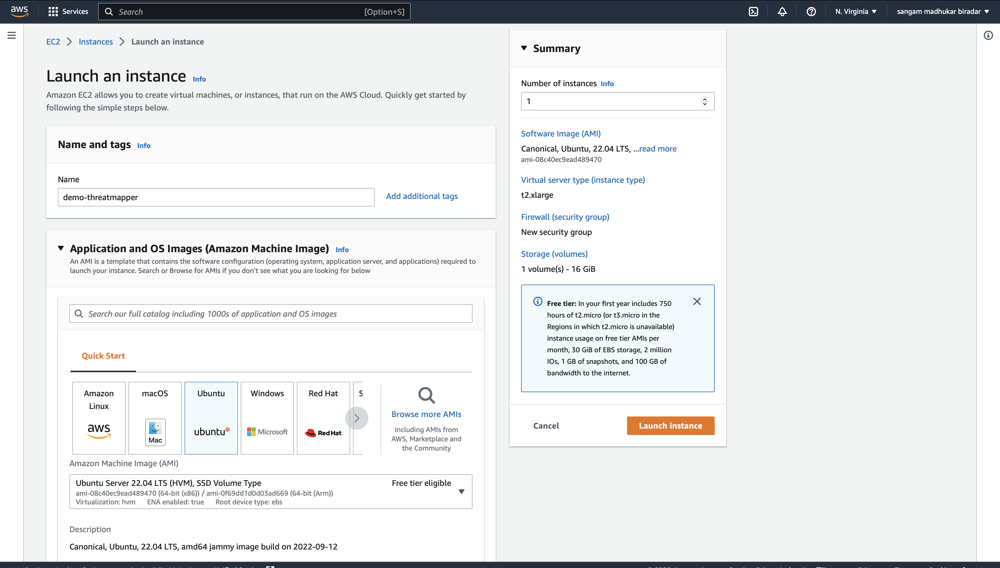

select instance type as per requirements 
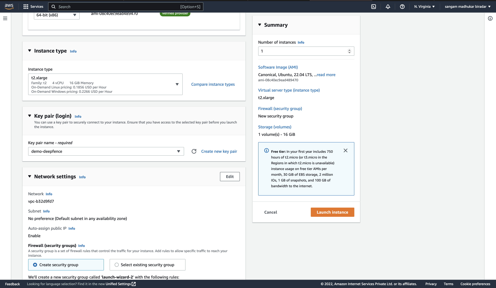
click on launch instance 
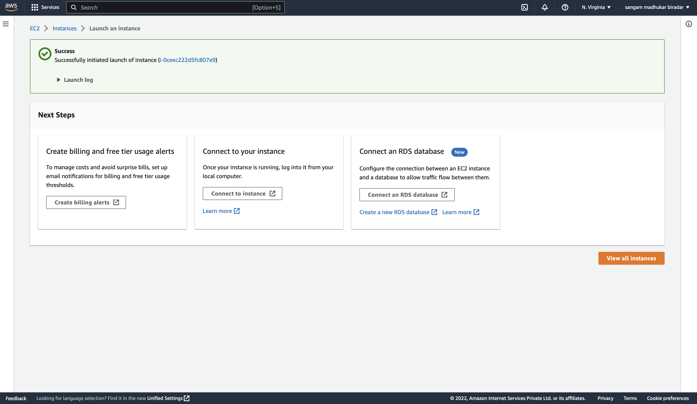
hurry ! 
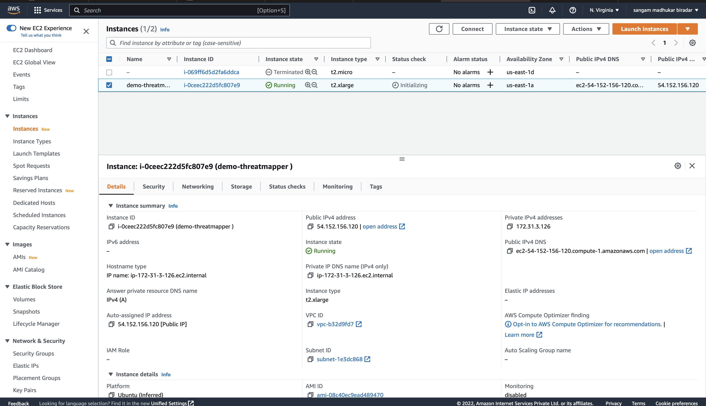
acces aws instance using cli 
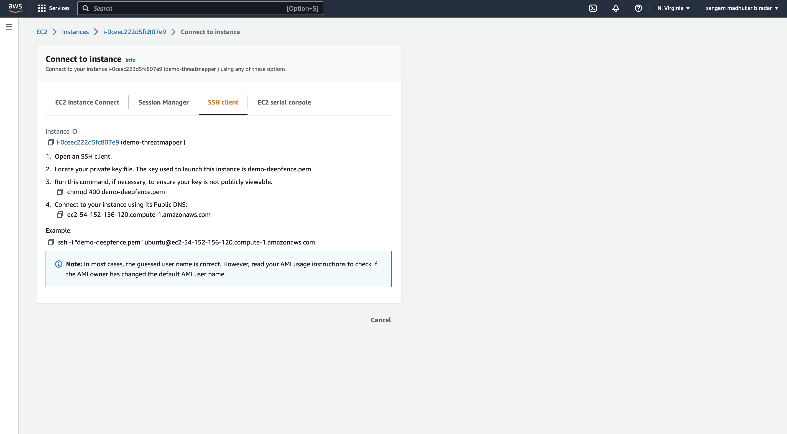

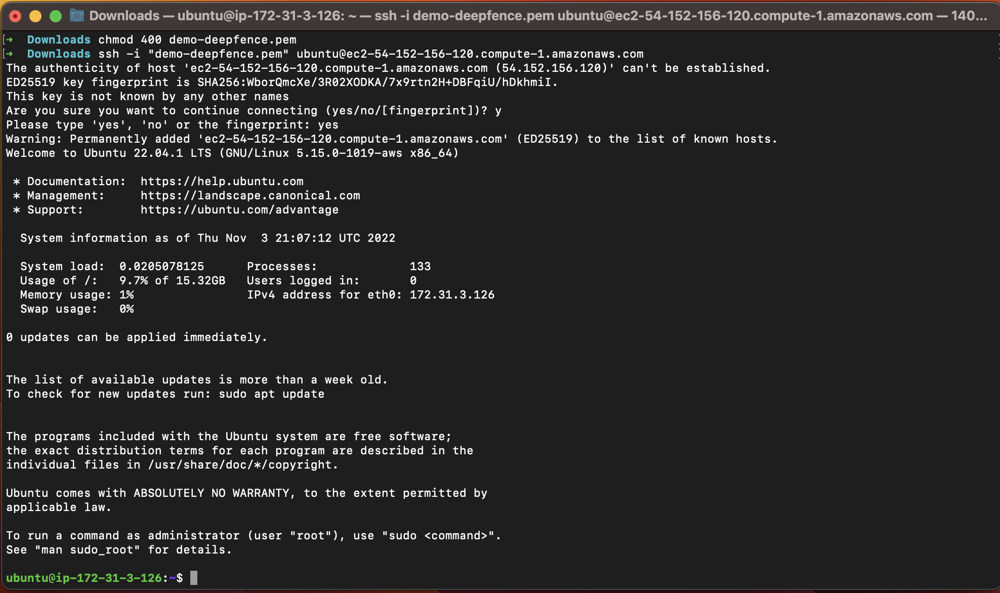
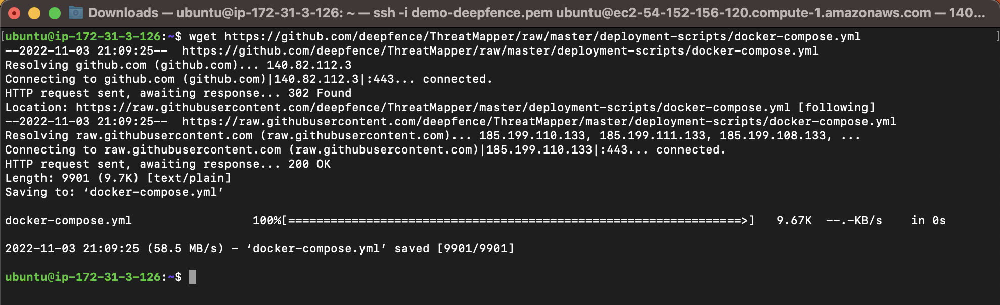
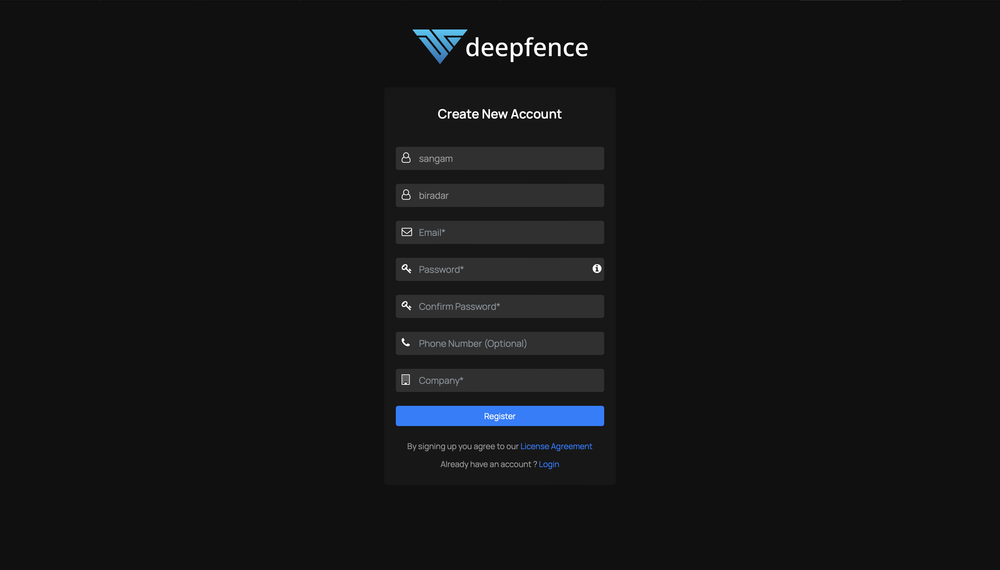
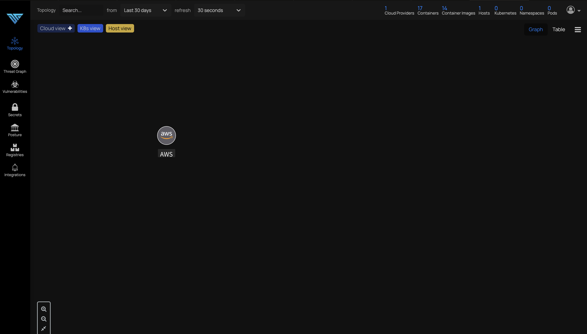
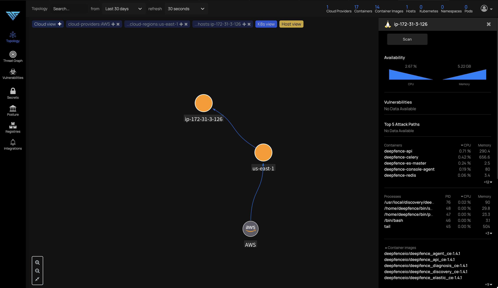

```
sudo apt install -y apt-transport-https ca-certificates curl software-properties-common
Reading package lists... Done
Building dependency tree... Done
Reading state information... Done
ca-certificates is already the newest version (20211016).
ca-certificates set to manually installed.
software-properties-common is already the newest version (0.99.22.3).
software-properties-common set to manually installed.
The following additional packages will be installed:
  libcurl4
The following NEW packages will be installed:
  apt-transport-https
The following packages will be upgraded:
  curl libcurl4
2 upgraded, 1 newly installed, 0 to remove and 76 not upgraded.
Need to get 485 kB of archives.
After this operation, 169 kB of additional disk space will be used.
Get:1 http://us-east-1.ec2.archive.ubuntu.com/ubuntu jammy-updates/universe amd64 apt-transport-https all 2.4.8 [1506 B]
Get:2 http://us-east-1.ec2.archive.ubuntu.com/ubuntu jammy-updates/main amd64 curl amd64 7.81.0-1ubuntu1.6 [194 kB]
Get:3 http://us-east-1.ec2.archive.ubuntu.com/ubuntu jammy-updates/main amd64 libcurl4 amd64 7.81.0-1ubuntu1.6 [290 kB]
Fetched 485 kB in 0s (11.0 MB/s)  
Selecting previously unselected package apt-transport-https.
(Reading database ... 63926 files and directories currently installed.)
Preparing to unpack .../apt-transport-https_2.4.8_all.deb ...
Unpacking apt-transport-https (2.4.8) ...
Preparing to unpack .../curl_7.81.0-1ubuntu1.6_amd64.deb ...
Unpacking curl (7.81.0-1ubuntu1.6) over (7.81.0-1ubuntu1.4) ...
Preparing to unpack .../libcurl4_7.81.0-1ubuntu1.6_amd64.deb ...
Unpacking libcurl4:amd64 (7.81.0-1ubuntu1.6) over (7.81.0-1ubuntu1.4) ...
Setting up apt-transport-https (2.4.8) ...
Setting up libcurl4:amd64 (7.81.0-1ubuntu1.6) ...
Setting up curl (7.81.0-1ubuntu1.6) ...
Processing triggers for man-db (2.10.2-1) ...
Processing triggers for libc-bin (2.35-0ubuntu3.1) ...
Scanning processes...                                                                                                                       
Scanning linux images...                                                                                                                    

Running kernel seems to be up-to-date.

```

# Install docker 

```
curl -fsSL https://download.docker.com/linux/ubuntu/gpg | sudo apt-key add -
sudo add-apt-repository "deb [arch=amd64] https://download.docker.com/linux/ubuntu focal stable"
apt-cache policy docker-ce
sudo apt install -y docker-ce
Warning: apt-key is deprecated. Manage keyring files in trusted.gpg.d instead (see apt-key(8)).
OK
Repository: 'deb [arch=amd64] https://download.docker.com/linux/ubuntu focal stable'
Description:
Archive for codename: focal components: stable
More info: https://download.docker.com/linux/ubuntu
Adding repository.
Press [ENTER] to continue or Ctrl-c to cancel.
Found existing deb entry in /etc/apt/sources.list.d/archive_uri-https_download_docker_com_linux_ubuntu-jammy.list
Adding deb entry to /etc/apt/sources.list.d/archive_uri-https_download_docker_com_linux_ubuntu-jammy.list
Found existing deb-src entry in /etc/apt/sources.list.d/archive_uri-https_download_docker_com_linux_ubuntu-jammy.list
Adding disabled deb-src entry to /etc/apt/sources.list.d/archive_uri-https_download_docker_com_linux_ubuntu-jammy.list
Hit:1 http://us-east-1.ec2.archive.ubuntu.com/ubuntu jammy InRelease
Hit:2 http://us-east-1.ec2.archive.ubuntu.com/ubuntu jammy-updates InRelease                            
Hit:3 http://us-east-1.ec2.archive.ubuntu.com/ubuntu jammy-backports InRelease                          
Hit:4 https://download.docker.com/linux/ubuntu focal InRelease                                          
Hit:5 http://security.ubuntu.com/ubuntu jammy-security InRelease                                        
Reading package lists... Done
W: https://download.docker.com/linux/ubuntu/dists/focal/InRelease: Key is stored in legacy trusted.gpg keyring (/etc/apt/trusted.gpg), see the DEPRECATION section in apt-key(8) for details.
docker-ce:
  Installed: 5:20.10.21~3-0~ubuntu-focal
  Candidate: 5:20.10.21~3-0~ubuntu-focal
  Version table:
 *** 5:20.10.21~3-0~ubuntu-focal 500
        500 https://download.docker.com/linux/ubuntu focal/stable amd64 Packages
        100 /var/lib/dpkg/status
     5:20.10.20~3-0~ubuntu-focal 500
        500 https://download.docker.com/linux/ubuntu focal/stable amd64 Packages
     5:20.10.19~3-0~ubuntu-focal 500
        500 https://download.docker.com/linux/ubuntu focal/stable amd64 Packages
     5:20.10.18~3-0~ubuntu-focal 500
        500 https://download.docker.com/linux/ubuntu focal/stable amd64 Packages
     5:20.10.17~3-0~ubuntu-focal 500
        500 https://download.docker.com/linux/ubuntu focal/stable amd64 Packages
     5:20.10.16~3-0~ubuntu-focal 500
        500 https://download.docker.com/linux/ubuntu focal/stable amd64 Packages
     5:20.10.15~3-0~ubuntu-focal 500
        500 https://download.docker.com/linux/ubuntu focal/stable amd64 Packages
     5:20.10.14~3-0~ubuntu-focal 500
        500 https://download.docker.com/linux/ubuntu focal/stable amd64 Packages
     5:20.10.13~3-0~ubuntu-focal 500
        500 https://download.docker.com/linux/ubuntu focal/stable amd64 Packages
     5:20.10.12~3-0~ubuntu-focal 500
        500 https://download.docker.com/linux/ubuntu focal/stable amd64 Packages
     5:20.10.11~3-0~ubuntu-focal 500
        500 https://download.docker.com/linux/ubuntu focal/stable amd64 Packages
     5:20.10.10~3-0~ubuntu-focal 500
        500 https://download.docker.com/linux/ubuntu focal/stable amd64 Packages
     5:20.10.9~3-0~ubuntu-focal 500
        500 https://download.docker.com/linux/ubuntu focal/stable amd64 Packages
     5:20.10.8~3-0~ubuntu-focal 500
        500 https://download.docker.com/linux/ubuntu focal/stable amd64 Packages
     5:20.10.7~3-0~ubuntu-focal 500
        500 https://download.docker.com/linux/ubuntu focal/stable amd64 Packages
     5:20.10.6~3-0~ubuntu-focal 500
        500 https://download.docker.com/linux/ubuntu focal/stable amd64 Packages
     5:20.10.5~3-0~ubuntu-focal 500
        500 https://download.docker.com/linux/ubuntu focal/stable amd64 Packages
     5:20.10.4~3-0~ubuntu-focal 500
        500 https://download.docker.com/linux/ubuntu focal/stable amd64 Packages
     5:20.10.3~3-0~ubuntu-focal 500
        500 https://download.docker.com/linux/ubuntu focal/stable amd64 Packages
     5:20.10.2~3-0~ubuntu-focal 500
        500 https://download.docker.com/linux/ubuntu focal/stable amd64 Packages
     5:20.10.1~3-0~ubuntu-focal 500
        500 https://download.docker.com/linux/ubuntu focal/stable amd64 Packages
     5:20.10.0~3-0~ubuntu-focal 500
        500 https://download.docker.com/linux/ubuntu focal/stable amd64 Packages
     5:19.03.15~3-0~ubuntu-focal 500
        500 https://download.docker.com/linux/ubuntu focal/stable amd64 Packages
     5:19.03.14~3-0~ubuntu-focal 500
        500 https://download.docker.com/linux/ubuntu focal/stable amd64 Packages
     5:19.03.13~3-0~ubuntu-focal 500
        500 https://download.docker.com/linux/ubuntu focal/stable amd64 Packages
     5:19.03.12~3-0~ubuntu-focal 500
        500 https://download.docker.com/linux/ubuntu focal/stable amd64 Packages
     5:19.03.11~3-0~ubuntu-focal 500
        500 https://download.docker.com/linux/ubuntu focal/stable amd64 Packages
     5:19.03.10~3-0~ubuntu-focal 500
        500 https://download.docker.com/linux/ubuntu focal/stable amd64 Packages
     5:19.03.9~3-0~ubuntu-focal 500
        500 https://download.docker.com/linux/ubuntu focal/stable amd64 Packages
Reading package lists... Done
Building dependency tree... Done
Reading state information... Done


```

# verify docker is installed or not 

```
docker 

Usage:  docker [OPTIONS] COMMAND

A self-sufficient runtime for containers

Options:
      --config string      Location of client config files (default "/home/ubuntu/.docker")
  -c, --context string     Name of the context to use to connect to the daemon (overrides DOCKER_HOST env var and default context set
                           with "docker context use")
  -D, --debug              Enable debug mode
  -H, --host list          Daemon socket(s) to connect to
  -l, --log-level string   Set the logging level ("debug"|"info"|"warn"|"error"|"fatal") (default "info")
      --tls                Use TLS; implied by --tlsverify
      --tlscacert string   Trust certs signed only by this CA (default "/home/ubuntu/.docker/ca.pem")
      --tlscert string     Path to TLS certificate file (default "/home/ubuntu/.docker/cert.pem")
      --tlskey string      Path to TLS key file (default "/home/ubuntu/.docker/key.pem")
      --tlsverify          Use TLS and verify the remote
  -v, --version            Print version information and quit

Management Commands:
  app*        Docker App (Docker Inc., v0.9.1-beta3)
  builder     Manage builds
  buildx*     Docker Buildx (Docker Inc., v0.9.1-docker)
  config      Manage Docker configs
  container   Manage containers
  context     Manage contexts
  image       Manage images
  manifest    Manage Docker image manifests and manifest lists
  network     Manage networks
  node        Manage Swarm nodes
  plugin      Manage plugins
  scan*       Docker Scan (Docker Inc., v0.21.0)
  secret      Manage Docker secrets
  service     Manage services
  stack       Manage Docker stacks
  swarm       Manage Swarm
  system      Manage Docker
  trust       Manage trust on Docker images
  volume      Manage volumes

Commands:
  attach      Attach local standard input, output, and error streams to a running container
  build       Build an image from a Dockerfile
  commit      Create a new image from a container's changes
  cp          Copy files/folders between a container and the local filesystem
  create      Create a new container
  diff        Inspect changes to files or directories on a container's filesystem
  events      Get real time events from the server
  exec        Run a command in a running container
  export      Export a container's filesystem as a tar archive
  history     Show the history of an image
  images      List images
  import      Import the contents from a tarball to create a filesystem image
  info        Display system-wide information
  inspect     Return low-level information on Docker objects
  kill        Kill one or more running containers
  load        Load an image from a tar archive or STDIN
  login       Log in to a Docker registry
  logout      Log out from a Docker registry
  logs        Fetch the logs of a container
  pause       Pause all processes within one or more containers
  port        List port mappings or a specific mapping for the container
  ps          List containers
  pull        Pull an image or a repository from a registry
  push        Push an image or a repository to a registry
  rename      Rename a container
  restart     Restart one or more containers
  rm          Remove one or more containers
  rmi         Remove one or more images
  run         Run a command in a new container
  save        Save one or more images to a tar archive (streamed to STDOUT by default)
  search      Search the Docker Hub for images
  start       Start one or more stopped containers
  stats       Display a live stream of container(s) resource usage statistics
  stop        Stop one or more running containers
  tag         Create a tag TARGET_IMAGE that refers to SOURCE_IMAGE
  top         Display the running processes of a container
  unpause     Unpause all processes within one or more containers
  update      Update configuration of one or more containers
  version     Show the Docker version information
  wait        Block until one or more containers stop, then print their exit codes

Run 'docker COMMAND --help' for more information on a command.


```


# install docker compose 

```
sudo sysctl -w vm.max_map_count=262144 
sudo curl -L https://github.com/docker/compose/releases/latest/download/docker-compose-linux-x86_64 -o /usr/local/bin/docker-compose
sudo mv /usr/local/bin/docker-compose /usr/bin/docker-compose
sudo chmod +x /usr/bin/docker-compose
docker-compose --version
vm.max_map_count = 262144

```

# docker compose up 

```
 sudo docker-compose -f docker-compose.yml up --detach
```


# pulling all docker images required for management console 

```
[+] Running 132/133al-router Pulled                                                                                                    5.1s
 ⠧ deepfence-ui Pulling                                                                                                               55.8s
   ⠿ ee30d1e46960 Pull complete                                                                                                       18.1s
   ⠿ cbdf55152882 Pull complete                                                                                                       20.7s
   ⠿ 02145a3d08dc Pull complete                                                                                                       24.4s
   ⠿ 3b43024e0402 Pull complete                                                                                                       25.5s
   ⠿ 000a421a9381 Pull complete                                                                                                       25.8s
   ⠿ 273e2d14a316 Pull complete                                                                                                       26.1s
   ⠿ 35f2174af386 Pull complete                                                                                                       52.7s
   ⠿ 3bf6d37d02af Pull complete                                                                                                       53.2s
   ⠿ 2ebf2edf21e9 Pull complete                                                                                                       53.7s
   ⠿ 70ecf58c4679 Pull complete                                                                                                       54.1s
 ⠿ deepfence-package-scanner Pulled                                                                                                    8.8s
   ⠿ 51dd59142225 Pull complete                                                                                                        4.0s
   ⠿ afd427f95343 Pull complete                                                                                                        5.2s
   ⠿ ad4b784c8601 Pull complete                                                                                                        7.5s
 ⠿ deepfence-backend Pulled                                                                                                           48.2s
 ⠿ deepfence-console-agent Pulled                                                                                                     46.4s
   ⠿ e0c9ebf1f052 Pull complete                                                                                                       25.5s
   ⠿ 9341ad80650d Pull complete                                                                                                       26.0s
   ⠿ b6a94e577185 Pull complete                                                                                                       26.9s
   ⠿ f2f4f6c497c7 Pull complete                                                                                                       27.4s
   ⠿ 83dc6dff4d1f Pull complete                                                                                                       27.8s
   ⠿ 2c66b377cc17 Pull complete                                                                                                       28.1s
   ⠿ ae95bb3e76fc Pull complete                                                                                                       29.9s
   ⠿ 58edf371ef84 Pull complete                                                                                                       30.5s
   ⠿ b5b91601778a Pull complete                                                                                                       30.9s
   ⠿ e7ca0b813b35 Pull complete                                                                                                       31.4s
   ⠿ bac5f99ed5ff Pull complete                                                                                                       32.2s
   ⠿ 0b03b6c6e703 Pull complete                                                                                                       32.7s
   ⠿ 00ef62c6beae Pull complete                                                                                                       33.1s
   ⠿ 2317941b432c Pull complete                                                                                                       33.4s
   ⠿ c78d4ef87429 Pull complete                                                                                                       33.8s
   ⠿ 52d6b999791e Pull complete                                                                                                       37.0s
   ⠿ 3c66ae264813 Pull complete                                                                                                       40.4s
   ⠿ fa91d8140bb4 Pull complete                                                                                                       44.0s
   ⠿ 415ec3af8b5c Pull complete                                                                                                       45.0s
 ⠿ deepfence-diagnosis Pulled                                                                                                          9.3s
   ⠿ d8089fb41a4e Pull complete                                                                                                        7.2s
   ⠿ 761247dc597b Pull complete                                                                                                        7.9s
 ⠿ deepfence-vulnerability-mapper Pulled                                                                                               9.0s
   ⠿ 9621f1afde84 Pull complete                                                                                                        4.8s
   ⠿ d2f87f45af97 Pull complete                                                                                                        5.8s
   ⠿ 0df38fc1dcc4 Pull complete                                                                                                        5.8s
   ⠿ 5ce3bac9b38d Pull complete                                                                                                        6.0s
   ⠿ b8a17e0751b8 Pull complete                                                                                                        7.7s
 ⠿ deepfence-redis Pulled                                                                                                             20.4s
   ⠿ 192e03523482 Pull complete                                                                                                       14.1s
   ⠿ 7151bccd2756 Pull complete                                                                                                       14.9s
   ⠿ e599fac432b2 Pull complete                                                                                                       16.0s
   ⠿ 720d86c10923 Pull complete                                                                                                       16.5s
   ⠿ 40911e48517b Pull complete                                                                                                       16.9s
   ⠿ 115eb662e680 Pull complete                                                                                                       17.3s
   ⠿ 31b9b283aa20 Pull complete                                                                                                       17.9s
   ⠿ b748b52207f7 Pull complete                                                                                                       18.3s
   ⠿ 5b0f449535b8 Pull complete                                                                                                       18.9s
 ⠿ deepfence-api Pulled                                                                                                               48.3s
   ⠿ 31b3f1ad4ce1 Pull complete                                                                                                        1.8s
   ⠿ f335cc1597f2 Pull complete                                                                                                        2.0s
   ⠿ 0375df124bb5 Pull complete                                                                                                        2.6s
   ⠿ 90a356bcda5b Pull complete                                                                                                        2.7s
   ⠿ c82e0170c13b Pull complete                                                                                                        2.9s
   ⠿ 38dc58c5f029 Pull complete                                                                                                        3.0s
   ⠿ 0189a7ca7a09 Pull complete                                                                                                       40.8s
   ⠿ 8d069dc99fe4 Pull complete                                                                                                       45.2s
   ⠿ 50e62824984f Pull complete                                                                                                       45.6s
   ⠿ c12613b81b5c Pull complete                                                                                                       45.8s
   ⠿ c8901960f9b5 Pull complete                                                                                                       45.9s
   ⠿ a5981c5eb3db Pull complete                                                                                                       46.3s
   ⠿ 860d4f2e0b1a Pull complete                                                                                                       46.8s
   ⠿ 8a3f7b35b548 Pull complete                                                                                                       47.0s
   ⠿ 37c02a7c1188 Pull complete                                                                                                       47.4s
 ⠿ deepfence-celery Pulled                                                                                                            48.2s
 ⠿ deepfence-postgres Pulled                                                                                                          28.2s
   ⠿ 7902437d3a12 Pull complete                                                                                                       10.9s
   ⠿ 709e2267bc98 Pull complete                                                                                                       11.5s
   ⠿ 10c5a0a9c34e Pull complete                                                                                                       21.4s
   ⠿ b46af7f38693 Pull complete                                                                                                       22.4s
   ⠿ 65aa0c237f80 Pull complete                                                                                                       23.3s
   ⠿ f6493ce74812 Pull complete                                                                                                       24.0s
   ⠿ eaac3b44f9d0 Pull complete                                                                                                       24.5s
   ⠿ 3b6db84bcdcc Pull complete                                                                                                       25.1s
   ⠿ 120ba5542ffd Pull complete                                                                                                       25.5s
   ⠿ 9fd0e93acee4 Pull complete                                                                                                       25.8s
   ⠿ 257465d6d91b Pull complete                                                                                                       26.1s
   ⠿ 568fad078a9c Pull complete                                                                                                       26.5s
 ⠿ deepfence-init-container Pulled                                                                                                    14.8s
   ⠿ 2ad0d7925a78 Pull complete                                                                                                       12.6s
   ⠿ 3e00d8e06113 Pull complete                                                                                                       13.2s
 ⠿ deepfence-es Pulled                                                                                                                41.1s
   ⠿ 4e9f2cdf4387 Pull complete                                                                                                       15.3s
   ⠿ 2e70516637d4 Pull complete                                                                                                       37.1s
   ⠿ ba468cc9ce22 Pull complete                                                                                                       37.6s
   ⠿ a2c864bf08ba Pull complete                                                                                                       38.1s
   ⠿ 7869dc55514f Pull complete                                                                                                       38.8s
   ⠿ 6320c0eaee7c Pull complete                                                                                                       39.5s
[+] Running 133/133al-router Pulled                                                                                                    5.1s
 ⠿ deepfence-ui Pulled                                                                                                                55.9s
   ⠿ ee30d1e46960 Pull complete                                                                                                       18.1s
   ⠿ cbdf55152882 Pull complete                                                                                                       20.7s
   ⠿ 02145a3d08dc Pull complete                                                                                                       24.4s
   ⠿ 3b43024e0402 Pull complete                                                                                                       25.5s
   ⠿ 000a421a9381 Pull complete                                                                                                       25.8s
   ⠿ 273e2d14a316 Pull complete                                                                                                       26.1s
   ⠿ 35f2174af386 Pull complete                                                                                                       52.7s
   ⠿ 3bf6d37d02af Pull complete                                                                                                       53.2s
   ⠿ 2ebf2edf21e9 Pull complete                                                                                                       53.7s
   ⠿ 70ecf58c4679 Pull complete                                                                                                       54.1s
 ⠿ deepfence-package-scanner Pulled                                                                                                    8.8s
   ⠿ 51dd59142225 Pull complete                                                                                                        4.0s
   ⠿ afd427f95343 Pull complete                                                                                                        5.2s
   ⠿ ad4b784c8601 Pull complete                                                                                                        7.5s
 ⠿ deepfence-backend Pulled                                                                                                           48.2s
 ⠿ deepfence-console-agent Pulled                                                                                                     46.4s
   ⠿ e0c9ebf1f052 Pull complete                                                                                                       25.5s
   ⠿ 9341ad80650d Pull complete                                                                                                       26.0s
   ⠿ b6a94e577185 Pull complete                                                                                                       26.9s
   ⠿ f2f4f6c497c7 Pull complete                                                                                                       27.4s
   ⠿ 83dc6dff4d1f Pull complete                                                                                                       27.8s
   ⠿ 2c66b377cc17 Pull complete                                                                                                       28.1s
   ⠿ ae95bb3e76fc Pull complete                                                                                                       29.9s
   ⠿ 58edf371ef84 Pull complete                                                                                                       30.5s
   ⠿ b5b91601778a Pull complete                                                                                                       30.9s
   ⠿ e7ca0b813b35 Pull complete                                                                                                       31.4s
   ⠿ bac5f99ed5ff Pull complete                                                                                                       32.2s
   ⠿ 0b03b6c6e703 Pull complete                                                                                                       32.7s
   ⠿ 00ef62c6beae Pull complete                                                                                                       33.1s
   ⠿ 2317941b432c Pull complete                                                                                                       33.4s
   ⠿ c78d4ef87429 Pull complete                                                                                                       33.8s
   ⠿ 52d6b999791e Pull complete                                                                                                       37.0s
   ⠿ 3c66ae264813 Pull complete                                                                                                       40.4s
   ⠿ fa91d8140bb4 Pull complete                                                                                                       44.0s
   ⠿ 415ec3af8b5c Pull complete                                                                                                       45.0s
 ⠿ deepfence-diagnosis Pulled                                                                                                          9.3s
   ⠿ d8089fb41a4e Pull complete                                                                                                        7.2s
   ⠿ 761247dc597b Pull complete                                                                                                        7.9s
 ⠿ deepfence-vulnerability-mapper Pulled                                                                                               9.0s
   ⠿ 9621f1afde84 Pull complete                                                                                                        4.8s
   ⠿ d2f87f45af97 Pull complete                                                                                                        5.8s
   ⠿ 0df38fc1dcc4 Pull complete                                                                                                        5.8s
   ⠿ 5ce3bac9b38d Pull complete                                                                                                        6.0s
   ⠿ b8a17e0751b8 Pull complete                                                                                                        7.7s
 ⠿ deepfence-redis Pulled                                                                                                             20.4s
   ⠿ 192e03523482 Pull complete                                                                                                       14.1s
   ⠿ 7151bccd2756 Pull complete                                                                                                       14.9s
   ⠿ e599fac432b2 Pull complete                                                                                                       16.0s
   ⠿ 720d86c10923 Pull complete                                                                                                       16.5s
   ⠿ 40911e48517b Pull complete                                                                                                       16.9s
   ⠿ 115eb662e680 Pull complete                                                                                                       17.3s
   ⠿ 31b9b283aa20 Pull complete                                                                                                       17.9s
   ⠿ b748b52207f7 Pull complete                                                                                                       18.3s
   ⠿ 5b0f449535b8 Pull complete                                                                                                       18.9s
 ⠿ deepfence-api Pulled                                                                                                               48.3s
   ⠿ 31b3f1ad4ce1 Pull complete                                                                                                        1.8s
   ⠿ f335cc1597f2 Pull complete                                                                                                        2.0s
   ⠿ 0375df124bb5 Pull complete                                                                                                        2.6s
   ⠿ 90a356bcda5b Pull complete                                                                                                        2.7s
   ⠿ c82e0170c13b Pull complete                                                                                                        2.9s
   ⠿ 38dc58c5f029 Pull complete                                                                                                        3.0s
   ⠿ 0189a7ca7a09 Pull complete                                                                                                       40.8s
   ⠿ 8d069dc99fe4 Pull complete                                                                                                       45.2s
   ⠿ 50e62824984f Pull complete                                                                                                       45.6s
   ⠿ c12613b81b5c Pull complete                                                                                                       45.8s
   ⠿ c8901960f9b5 Pull complete                                                                                                       45.9s
   ⠿ a5981c5eb3db Pull complete                                                                                                       46.3s
   ⠿ 860d4f2e0b1a Pull complete                                                                                                       46.8s
   ⠿ 8a3f7b35b548 Pull complete                                                                                                       47.0s
   ⠿ 37c02a7c1188 Pull complete                                                                                                       47.4s
 ⠿ deepfence-celery Pulled                                                                                                            48.2s
 ⠿ deepfence-postgres Pulled                                                                                                          28.2s
   ⠿ 7902437d3a12 Pull complete                                                                                                       10.9s
   ⠿ 709e2267bc98 Pull complete                                                                                                       11.5s
   ⠿ 10c5a0a9c34e Pull complete                                                                                                       21.4s
   ⠿ b46af7f38693 Pull complete                                                                                                       22.4s
   ⠿ 65aa0c237f80 Pull complete                                                                                                       23.3s
   ⠿ f6493ce74812 Pull complete                                                                                                       24.0s
   ⠿ eaac3b44f9d0 Pull complete                                                                                                       24.5s
   ⠿ 3b6db84bcdcc Pull complete                                                                                                       25.1s
   ⠿ 120ba5542ffd Pull complete                                                                                                       25.5s
   ⠿ 9fd0e93acee4 Pull complete                                                                                                       25.8s
   ⠿ 257465d6d91b Pull complete                                                                                                       26.1s
   ⠿ 568fad078a9c Pull complete                                                                                                       26.5s
 ⠿ deepfence-init-container Pulled                                                                                                    14.8s
   ⠿ 2ad0d7925a78 Pull complete                                                                                                       12.6s
   ⠿ 3e00d8e06113 Pull complete                                                                                                       13.2s
 ⠿ deepfence-es Pulled                                                                                                                41.1s
   ⠿ 4e9f2cdf4387 Pull complete                                                                                                       15.3s
   ⠿ 2e70516637d4 Pull complete                                                                                                       37.1s
   ⠿ ba468cc9ce22 Pull complete                                                                                                       37.6s
   ⠿ a2c864bf08ba Pull complete                                                                                                       38.1s
   ⠿ 7869dc55514f Pull complete                                                                                                       38.8s
   ⠿ 6320c0eaee7c Pull complete                                                                                                       39.5s
 ⠿ deepfence-internal-router Pulled                                                                                                    5.1s
 ⠿ deepfence-secret-scanner Pulled                                                                                                    43.2s
   ⠿ c963e9db8328 Pull complete                                                                                                       34.6s
   ⠿ 7f20bc208900 Pull complete                                                                                                       35.0s
   ⠿ a11f9e68c7c1 Pull complete                                                                                                       36.3s
   ⠿ bac7f7e29d55 Pull complete                                                                                                       36.5s
   ⠿ a34450f81e53 Pull complete                                                                                                       37.2s
   ⠿ 8dc83348f20e Pull complete                                                                                                       41.0s
   ⠿ 1789eac203f6 Pull complete                                                                                                       41.6s
 ⠿ deepfence-fetcher Pulled                                                                                                           44.4s
   ⠿ 59bf1c3509f3 Pull complete                                                                                                       22.1s
   ⠿ 7f019d2ddd3b Pull complete                                                                                                       23.2s
   ⠿ d365c5dd6d5a Pull complete                                                                                                       23.7s
   ⠿ 86b2e2904ff3 Pull complete                                                                                                       24.2s
   ⠿ 9e8d01c5b686 Pull complete                                                                                                       42.5s
 ⠿ deepfence-router Pulled                                                                                                             5.1s
   ⠿ df9b9388f04a Pull complete                                                                                                        1.8s
   ⠿ 7c1ae225ee09 Pull complete                                                                                                        1.9s
   ⠿ d67475b58d2b Pull complete                                                                                                        2.5s
   ⠿ 403f08e781eb Pull complete                                                                                                        2.6s
   ⠿ 452f212a53d1 Pull complete                                                                                                        2.8s
   ⠿ 437cebde658b Pull complete                                                                                                        2.8s
   ⠿ 7c9ad45672b2 Pull complete                                                                                                        2.9s
   ⠿ 7d72372a1383 Pull complete                                                                                                        3.1s
   ⠿ d6bb5a9a1f12 Pull complete                                                                                                        3.2s
   ⠿ 7cf149b1a854 Pull complete                                                                                                        3.3s
   ⠿ b6e2429d9e38 Pull complete                                                                                                        3.3s
   ⠿ 92dcd490ec00 Pull complete                                                                                                        3.4s
   ⠿ 617b7a99eac3 Pull complete                                                                                                        3.5s
   ⠿ 259e00ee3450 Pull complete                                                                                                        3.6s
   ⠿ 83bec234123b Pull complete                                                                                                        3.7s
   ⠿ 928a4d3b5efe Pull complete                                                                                                        3.8s
 ⠿ deepfence-topology Pulled                                                                                                          34.0s
   ⠿ a0d0a0d46f8b Pull complete                                                                                                       16.0s
   ⠿ 127cfa2b873d Pull complete                                                                                                       16.6s
   ⠿ 15a88de45267 Pull complete                                                                                                       30.3s
   ⠿ 35233bb75987 Pull complete                                                                                                       32.0s
   ⠿ 8133cfb2a953 Pull complete                                                                                                       32.4s
[+] Running 19/19
 ⠿ Network ubuntu_deepfence_net              Created                                                                                   0.3s
 ⠿ Volume "ubuntu_deepfence_data"            Created                                                                                   0.0s
 ⠿ Container deepfence-postgres              Started                                                                                  16.5s
 ⠿ Container deepfence-secret-scanner        Started                                                                                  18.4s
 ⠿ Container deepfence-vulnerability-mapper  Started                                                                                  17.3s
 ⠿ Container deepfence-diagnosis             Started                                                                                  17.5s
 ⠿ Container deepfence-package-scanner       Started                                                                                  17.7s
 ⠿ Container deepfence-console-agent         Started                                                                                  16.0s
 ⠿ Container deepfence-es-master             Started                                                                                  17.1s
 ⠿ Container df-init-container               Started                                                                                  16.0s
 ⠿ Container deepfence-topology              Started                                                                                  17.3s
 ⠿ Container deepfence-router                Started                                                                                  18.4s
 ⠿ Container deepfence-internal-router       Started                                                                                  17.5s
 ⠿ Container deepfence-redis                 Started                                                                                   2.3s
 ⠿ Container deepfence-ui                    Started                                                                                   2.8s
 ⠿ Container deepfence-fetcher               Started                                                                                   2.4s
 ⠿ Container deepfence-celery                Started                                                                                   3.5s
 ⠿ Container deepfence-api                   Started                                                                                   3.4s
 ⠿ Container deepfence-backend               Started                                                                                   3.1s
 ```

## check all runing docker containers 

```

docker ps
CONTAINER ID   IMAGE                                                 COMMAND                  CREATED              STATUS              PORTS                                                                      NAMES
4514ee6713ac   deepfenceio/deepfence_api_ce:1.4.1                    "/app/code/dockerify…"   About a minute ago   Up About a minute                                                                              deepfence-api
1ba3ffed69da   deepfenceio/deepfence_api_ce:1.4.1                    "/app/code/dockerify…"   About a minute ago   Up About a minute                                                                              deepfence-backend
8bab0ec9f33c   deepfenceio/deepfence_api_ce:1.4.1                    "/app/code/dockerify…"   About a minute ago   Up About a minute                                                                              deepfence-celery
22656ac2f42e   deepfenceio/deepfence_fetcher_ce:1.4.1                "/usr/bin/start_fetc…"   About a minute ago   Up About a minute   8006/tcp                                                                   deepfence-fetcher
53e90c2fb2ee   deepfenceio/deepfence_ui_ce:1.4.1                     "/home/deepfence/ent…"   About a minute ago   Up About a minute                                                                              deepfence-ui
ef95a5d836af   deepfenceio/deepfence_redis_ce:1.4.1                  "/usr/local/bin/star…"   About a minute ago   Up About a minute   6379/tcp                                                                   deepfence-redis
41861a1a902d   deepfenceio/deepfence_elastic_ce:1.4.1                "/usr/bin/startEs.sh…"   About a minute ago   Up About a minute   127.0.0.1:9200->9200/tcp, 127.0.0.1:9300->9300/tcp                         deepfence-es-master
d7f746d048f1   deepfenceio/deepfence_router_ce:1.4.1                 "docker-entrypoint.s…"   About a minute ago   Up About a minute   0.0.0.0:80->80/tcp, :::80->80/tcp, 0.0.0.0:443->443/tcp, :::443->443/tcp   deepfence-router
c3e6524325b1   deepfenceio/deepfence_vulnerability_mapper_ce:1.4.1   "/entrypoint.sh"         About a minute ago   Up About a minute   8001/tcp                                                                   deepfence-vulnerability-mapper
4331c9eeb50f   deepfenceio/deepfence_router_ce:1.4.1                 "docker-entrypoint.s…"   About a minute ago   Up About a minute   127.0.0.1:8443->443/tcp                                                    deepfence-internal-router
16fae4515f45   deepfenceio/deepfence_diagnosis_ce:1.4.1              "/home/diagnosis"        About a minute ago   Up About a minute                                                                              deepfence-diagnosis
515a139b6c8f   deepfenceio/deepfence_agent_ce:1.4.1                  "/usr/local/bin/star…"   About a minute ago   Up About a minute                                                                              deepfence-console-agent
10ac5757f982   deepfenceio/deepfence_postgres_ce:1.4.1               "docker-entrypoint.s…"   About a minute ago   Up About a minute   5432/tcp                                                                   deepfence-postgres
50621d650d96   deepfenceio/deepfence_package_scanner_ce:1.4.1        "/usr/local/bin/pack…"   About a minute ago   Up About a minute   8002/tcp, 8005/tcp                                                         deepfence-package-scanner
0e96086bc3d0   deepfenceio/deepfence_discovery_ce:1.4.1              "/home/deepfence/ent…"   About a minute ago   Up About a minute   127.0.0.1:8004->8004/tcp                                                   deepfence-topology
bda5019a336a   deepfenceio/deepfence_secret_scanner_ce:1.4.1         "/home/deepfence/usr…"   About a minute ago   Up About a minute                                                                              deepfence-secret-scanner


```

# access threatmapper console using aws instance public ip 


Demo 2 


# To create your Amazon EKS cluster role in the IAM console

Open the IAM console at https://console.aws.amazon.com/iam/.
Choose Roles, then Create role.
Under Trusted entity type, select AWS service.
From the Use cases for other AWS services dropdown list, choose EKS.
Choose EKS - Cluster for your use case, and then choose Next.
On the Add permissions tab, choose Next.
For Role name, enter a unique name for your role, such as eksClusterRole.
For Description, enter descriptive text such as Amazon EKS - Cluster role.
Choose Create role.

## install Kubectl 

```
url -LO https://storage.googleapis.com/kubernetes-release/release/`curl -s https://storage.googleapis.com/kubernetes-release/release/stable.txt`/bin/linux/amd64/kubectl
  % Total    % Received % Xferd  Average Speed   Time    Time     Time  Current
                                 Dload  Upload   Total   Spent    Left  Speed
100 42.9M  100 42.9M    0     0  19.4M      0  0:00:02  0:00:02 --:--:-- 19.4M
ubuntu@ip-172-31-1-211:~$ chmod +x ./kubectl
ubuntu@ip-172-31-1-211:~$ sudo mv ./kubectl /usr/local/bin/kubectl
ubuntu@ip-172-31-1-211:~$ sudo apt-get update && \
    sudo apt-get install docker.io -y
Hit:1 http://us-east-1.ec2.archive.ubuntu.com/ubuntu jammy InRelease
Get:2 http://us-east-1.ec2.archive.ubuntu.com/ubuntu jammy-updates InRelease [114 kB]
Get:3 http://us-east-1.ec2.archive.ubuntu.com/ubuntu jammy-backports InRelease [99.8 kB]
Get:4 http://us-east-1.ec2.archive.ubuntu.com/ubuntu jammy/universe amd64 Packages [14.1 MB]
Get:5 http://us-east-1.ec2.archive.ubuntu.com/ubuntu jammy/universe Translation-en [5652 kB]
Get:6 http://security.ubuntu.com/ubuntu jammy-security InRelease [110 kB]            
Get:7 http://us-east-1.ec2.archive.ubuntu.com/ubuntu jammy/universe amd64 c-n-f Metadata [286 kB]
Get:8 http://us-east-1.ec2.archive.ubuntu.com/ubuntu jammy/multiverse amd64 Packages [217 kB]
Get:9 http://us-east-1.ec2.archive.ubuntu.com/ubuntu jammy/multiverse Translation-en [112 kB]
Get:10 http://us-east-1.ec2.archive.ubuntu.com/ubuntu jammy/multiverse amd64 c-n-f Metadata [8372 B]
Get:11 http://us-east-1.ec2.archive.ubuntu.com/ubuntu jammy-updates/main amd64 Packages [695 kB]
Get:12 http://us-east-1.ec2.archive.ubuntu.com/ubuntu jammy-updates/main Translation-en [159 kB]
Get:13 http://us-east-1.ec2.archive.ubuntu.com/ubuntu jammy-updates/main amd64 c-n-f Metadata [10.8 kB]
Get:14 http://us-east-1.ec2.archive.ubuntu.com/ubuntu jammy-updates/restricted amd64 Packages [410 kB]
Get:15 http://us-east-1.ec2.archive.ubuntu.com/ubuntu jammy-updates/restricted Translation-en [63.1 kB]
Get:16 http://us-east-1.ec2.archive.ubuntu.com/ubuntu jammy-updates/restricted amd64 c-n-f Metadata [544 B]
Get:17 http://us-east-1.ec2.archive.ubuntu.com/ubuntu jammy-updates/universe amd64 Packages [743 kB]
Get:18 http://us-east-1.ec2.archive.ubuntu.com/ubuntu jammy-updates/universe Translation-en [122 kB]
Get:19 http://us-east-1.ec2.archive.ubuntu.com/ubuntu jammy-updates/universe amd64 c-n-f Metadata [4404 B]
Get:20 http://us-east-1.ec2.archive.ubuntu.com/ubuntu jammy-updates/multiverse amd64 Packages [13.7 kB]
Get:21 http://us-east-1.ec2.archive.ubuntu.com/ubuntu jammy-updates/multiverse Translation-en [4228 B]
Get:22 http://us-east-1.ec2.archive.ubuntu.com/ubuntu jammy-updates/multiverse amd64 c-n-f Metadata [420 B]
Get:23 http://us-east-1.ec2.archive.ubuntu.com/ubuntu jammy-backports/main amd64 Packages [3008 B]
Get:24 http://us-east-1.ec2.archive.ubuntu.com/ubuntu jammy-backports/main Translation-en [1432 B]
Get:25 http://us-east-1.ec2.archive.ubuntu.com/ubuntu jammy-backports/main amd64 c-n-f Metadata [272 B]
Get:26 http://us-east-1.ec2.archive.ubuntu.com/ubuntu jammy-backports/restricted amd64 c-n-f Metadata [116 B]
Get:27 http://us-east-1.ec2.archive.ubuntu.com/ubuntu jammy-backports/universe amd64 Packages [6752 B]
Get:28 http://us-east-1.ec2.archive.ubuntu.com/ubuntu jammy-backports/universe Translation-en [9360 B]
Get:29 http://us-east-1.ec2.archive.ubuntu.com/ubuntu jammy-backports/universe amd64 c-n-f Metadata [356 B]
Get:30 http://us-east-1.ec2.archive.ubuntu.com/ubuntu jammy-backports/multiverse amd64 c-n-f Metadata [116 B]
Get:31 http://security.ubuntu.com/ubuntu jammy-security/main amd64 Packages [461 kB]     
Get:32 http://security.ubuntu.com/ubuntu jammy-security/main Translation-en [101 kB]
Get:33 http://security.ubuntu.com/ubuntu jammy-security/restricted amd64 Packages [372 kB]                
Get:34 http://security.ubuntu.com/ubuntu jammy-security/restricted Translation-en [57.4 kB]               
Get:35 http://security.ubuntu.com/ubuntu jammy-security/universe amd64 Packages [602 kB]                  
Get:36 http://security.ubuntu.com/ubuntu jammy-security/universe Translation-en [76.6 kB]                 
Get:37 http://security.ubuntu.com/ubuntu jammy-security/universe amd64 c-n-f Metadata [2408 B]            
Get:38 http://security.ubuntu.com/ubuntu jammy-security/multiverse amd64 Packages [4192 B]                
Get:39 http://security.ubuntu.com/ubuntu jammy-security/multiverse Translation-en [900 B]                 
Get:40 http://security.ubuntu.com/ubuntu jammy-security/multiverse amd64 c-n-f Metadata [228 B]           
Fetched 24.6 MB in 18s (1357 kB/s)                                                                        
Reading package lists... Done
Reading package lists... Done
Building dependency tree... Done
Reading state information... Done
The following additional packages will be installed:
  bridge-utils containerd dns-root-data dnsmasq-base pigz runc ubuntu-fan
Suggested packages:
  ifupdown aufs-tools cgroupfs-mount | cgroup-lite debootstrap docker-doc rinse zfs-fuse | zfsutils
The following NEW packages will be installed:
  bridge-utils containerd dns-root-data dnsmasq-base docker.io pigz runc ubuntu-fan
0 upgraded, 8 newly installed, 0 to remove and 78 not upgraded.
Need to get 65.6 MB of archives.
After this operation, 283 MB of additional disk space will be used.
Get:1 http://us-east-1.ec2.archive.ubuntu.com/ubuntu jammy/universe amd64 pigz amd64 2.6-1 [63.6 kB]
Get:2 http://us-east-1.ec2.archive.ubuntu.com/ubuntu jammy/main amd64 bridge-utils amd64 1.7-1ubuntu3 [34.4 kB]
Get:3 http://us-east-1.ec2.archive.ubuntu.com/ubuntu jammy/main amd64 runc amd64 1.1.0-0ubuntu1 [4087 kB]
Get:4 http://us-east-1.ec2.archive.ubuntu.com/ubuntu jammy/main amd64 containerd amd64 1.5.9-0ubuntu3 [27.0 MB]
Get:5 http://us-east-1.ec2.archive.ubuntu.com/ubuntu jammy/main amd64 dns-root-data all 2021011101 [5256 B]
Get:6 http://us-east-1.ec2.archive.ubuntu.com/ubuntu jammy-updates/main amd64 dnsmasq-base amd64 2.86-1.1ubuntu0.1 [354 kB]
Get:7 http://us-east-1.ec2.archive.ubuntu.com/ubuntu jammy/universe amd64 docker.io amd64 20.10.12-0ubuntu4 [34.0 MB]
Get:8 http://us-east-1.ec2.archive.ubuntu.com/ubuntu jammy/universe amd64 ubuntu-fan all 0.12.16 [35.2 kB]
Fetched 65.6 MB in 1s (44.5 MB/s)      
Preconfiguring packages ...
Selecting previously unselected package pigz.
(Reading database ... 63663 files and directories currently installed.)
Preparing to unpack .../0-pigz_2.6-1_amd64.deb ...
Unpacking pigz (2.6-1) ...
Selecting previously unselected package bridge-utils.
Preparing to unpack .../1-bridge-utils_1.7-1ubuntu3_amd64.deb ...
Unpacking bridge-utils (1.7-1ubuntu3) ...
Selecting previously unselected package runc.
Preparing to unpack .../2-runc_1.1.0-0ubuntu1_amd64.deb ...
Unpacking runc (1.1.0-0ubuntu1) ...
Selecting previously unselected package containerd.
Preparing to unpack .../3-containerd_1.5.9-0ubuntu3_amd64.deb ...
Unpacking containerd (1.5.9-0ubuntu3) ...
Selecting previously unselected package dns-root-data.
Preparing to unpack .../4-dns-root-data_2021011101_all.deb ...
Unpacking dns-root-data (2021011101) ...
Selecting previously unselected package dnsmasq-base.
Preparing to unpack .../5-dnsmasq-base_2.86-1.1ubuntu0.1_amd64.deb ...
Unpacking dnsmasq-base (2.86-1.1ubuntu0.1) ...
Selecting previously unselected package docker.io.
Preparing to unpack .../6-docker.io_20.10.12-0ubuntu4_amd64.deb ...
Unpacking docker.io (20.10.12-0ubuntu4) ...
Selecting previously unselected package ubuntu-fan.
Preparing to unpack .../7-ubuntu-fan_0.12.16_all.deb ...
Unpacking ubuntu-fan (0.12.16) ...
Setting up dnsmasq-base (2.86-1.1ubuntu0.1) ...
Setting up runc (1.1.0-0ubuntu1) ...
Setting up dns-root-data (2021011101) ...
Setting up bridge-utils (1.7-1ubuntu3) ...
Setting up pigz (2.6-1) ...
Setting up containerd (1.5.9-0ubuntu3) ...
Created symlink /etc/systemd/system/multi-user.target.wants/containerd.service → /lib/systemd/system/containerd.service.
Setting up ubuntu-fan (0.12.16) ...
Created symlink /etc/systemd/system/multi-user.target.wants/ubuntu-fan.service → /lib/systemd/system/ubuntu-fan.service.
Setting up docker.io (20.10.12-0ubuntu4) ...
Adding group `docker' (GID 121) ...
Done.
Created symlink /etc/systemd/system/multi-user.target.wants/docker.service → /lib/systemd/system/docker.service.
Created symlink /etc/systemd/system/sockets.target.wants/docker.socket → /lib/systemd/system/docker.socket.
Processing triggers for dbus (1.12.20-2ubuntu4) ...
Processing triggers for man-db (2.10.2-1) ...
Scanning processes...                                                                                      
Scanning linux images...                                                                                   

Running kernel seems to be up-to-date.

No services need to be restarted.

No containers need to be restarted.

No user sessions are running outdated binaries.


```

## install minikube 


```
curl -Lo minikube https://storage.googleapis.com/minikube/releases/latest/minikube-linux-amd64 && chmod +x minikube && sudo mv minikube /usr/local/bin/
  % Total    % Received % Xferd  Average Speed   Time    Time     Time  Current
                                 Dload  Upload   Total   Spent    Left  Speed
100 73.0M  100 73.0M    0     0  79.5M      0 --:--:-- --:--:-- --:--:-- 79.5M
ubuntu@ip-172-31-1-211:~$ minikube version
minikube version: v1.27.1
commit: fe869b5d4da11ba318eb84a3ac00f336411de7ba


```
## start minikube 

```

sudo usermod -aG docker $USER && newgrp docker
ubuntu@ip-172-31-1-211:~$ minikube start
😄  minikube v1.27.1 on Ubuntu 22.04 (xen/amd64)
✨  Automatically selected the docker driver. Other choices: none, ssh
📌  Using Docker driver with root privileges
👍  Starting control plane node minikube in cluster minikube
🚜  Pulling base image ...
💾  Downloading Kubernetes v1.25.2 preload ...
    > preloaded-images-k8s-v18-v1...:  385.41 MiB / 385.41 MiB  100.00% 62.28 M
    > gcr.io/k8s-minikube/kicbase:  387.11 MiB / 387.11 MiB  100.00% 44.77 MiB 
    > gcr.io/k8s-minikube/kicbase:  0 B [_______________________] ?% ? p/s 5.8s
🔥  Creating docker container (CPUs=2, Memory=2200MB) ...
🐳  Preparing Kubernetes v1.25.2 on Docker 20.10.18 ...
    ▪ Generating certificates and keys ...
    ▪ Booting up control plane ...
    ▪ Configuring RBAC rules ...
🔎  Verifying Kubernetes components...
    ▪ Using image gcr.io/k8s-minikube/storage-provisioner:v5
🌟  Enabled addons: storage-provisioner, default-storageclass
🏄  Done! kubectl is now configured to use "minikube" cluster and "default" namespace by default
ubuntu@ip-172-31-1-211:~$ minikube
minikube provisions and manages local Kubernetes clusters optimized for development workflows.

Basic Commands:
  start            Starts a local Kubernetes cluster
  status           Gets the status of a local Kubernetes cluster
  stop             Stops a running local Kubernetes cluster
  delete           Deletes a local Kubernetes cluster
  dashboard        Access the Kubernetes dashboard running within the minikube cluster
  pause            pause Kubernetes
  unpause          unpause Kubernetes

Images Commands:
  docker-env       Provides instructions to point your terminal's docker-cli to the Docker Engine
inside minikube. (Useful for building docker images directly inside minikube)
  podman-env       Configure environment to use minikube's Podman service
  cache            Manage cache for images
  image            Manage images

Configuration and Management Commands:
  addons           Enable or disable a minikube addon
  config           Modify persistent configuration values
  profile          Get or list the current profiles (clusters)
  update-context   Update kubeconfig in case of an IP or port change

Networking and Connectivity Commands:
  service          Returns a URL to connect to a service
  tunnel           Connect to LoadBalancer services

Advanced Commands:
  mount            Mounts the specified directory into minikube
  ssh              Log into the minikube environment (for debugging)
  kubectl          Run a kubectl binary matching the cluster version
  node             Add, remove, or list additional nodes
  cp               Copy the specified file into minikube

Troubleshooting Commands:
  ssh-key          Retrieve the ssh identity key path of the specified node
  ssh-host         Retrieve the ssh host key of the specified node
  ip               Retrieves the IP address of the specified node
  logs             Returns logs to debug a local Kubernetes cluster
  update-check     Print current and latest version number
  version          Print the version of minikube
  options          Show a list of global command-line options (applies to all commands).

Other Commands:
  completion       Generate command completion for a shell


```


## install helm chart 

```

ubuntu@ip-172-31-1-211:~$ curl https://baltocdn.com/helm/signing.asc | gpg --dearmor | sudo tee /usr/share/keyrings/helm.gpg > /dev/null
sudo apt-get install apt-transport-https --yes
echo "deb [arch=$(dpkg --print-architecture) signed-by=/usr/share/keyrings/helm.gpg] https://baltocdn.com/helm/stable/debian/ all main" | sudo tee /etc/apt/sources.list.d/helm-stable-debian.list
sudo apt-get update
sudo apt-get install helm
  % Total    % Received % Xferd  Average Speed   Time    Time     Time  Current
                                 Dload  Upload   Total   Spent    Left  Speed
100  1700  100  1700    0     0  12006      0 --:--:-- --:--:-- --:--:-- 11971
Reading package lists... Done
Building dependency tree... Done
Reading state information... Done
The following NEW packages will be installed:
  apt-transport-https
0 upgraded, 1 newly installed, 0 to remove and 78 not upgraded.
Need to get 1506 B of archives.
After this operation, 169 kB of additional disk space will be used.
Get:1 http://us-east-1.ec2.archive.ubuntu.com/ubuntu jammy-updates/universe amd64 apt-transport-https all 2.4.8 [1506 B]
Fetched 1506 B in 0s (80.3 kB/s)              
Selecting previously unselected package apt-transport-https.
(Reading database ... 64017 files and directories currently installed.)
Preparing to unpack .../apt-transport-https_2.4.8_all.deb ...
Unpacking apt-transport-https (2.4.8) ...
Setting up apt-transport-https (2.4.8) ...
Scanning processes...                                                                                      
Scanning linux images...                                                                                   

Running kernel seems to be up-to-date.

No services need to be restarted.

No containers need to be restarted.

No user sessions are running outdated binaries.

No VM guests are running outdated hypervisor (qemu) binaries on this host.
deb [arch=amd64 signed-by=/usr/share/keyrings/helm.gpg] https://baltocdn.com/helm/stable/debian/ all main
Hit:1 http://us-east-1.ec2.archive.ubuntu.com/ubuntu jammy InRelease
Hit:2 http://us-east-1.ec2.archive.ubuntu.com/ubuntu jammy-updates InRelease
Hit:3 http://us-east-1.ec2.archive.ubuntu.com/ubuntu jammy-backports InRelease
Hit:4 http://security.ubuntu.com/ubuntu jammy-security InRelease
Get:5 https://baltocdn.com/helm/stable/debian all InRelease [7652 B]
Get:6 https://baltocdn.com/helm/stable/debian all/main amd64 Packages [3012 B]
Fetched 10.7 kB in 0s (26.0 kB/s)   
Reading package lists... Done
Reading package lists... Done
Building dependency tree... Done
Reading state information... Done
The following NEW packages will be installed:
  helm
0 upgraded, 1 newly installed, 0 to remove and 78 not upgraded.
Need to get 14.5 MB of archives.
After this operation, 45.1 MB of additional disk space will be used.
Get:1 https://baltocdn.com/helm/stable/debian all/main amd64 helm amd64 3.10.1-1 [14.5 MB]
Fetched 14.5 MB in 0s (68.6 MB/s)
Selecting previously unselected package helm.
(Reading database ... 64021 files and directories currently installed.)
Preparing to unpack .../helm_3.10.1-1_amd64.deb ...
Unpacking helm (3.10.1-1) ...
Setting up helm (3.10.1-1) ...
Processing triggers for man-db (2.10.2-1) ...
Scanning processes...                                                                                      
Scanning linux images...                                                                                   

Running kernel seems to be up-to-date.

No services need to be restarted.

No containers need to be restarted.

No user sessions are running outdated binaries.

No VM guests are running outdated hypervisor (qemu) binaries on this host.
ubuntu@ip-172-31-1-211:~$ helm
The Kubernetes package manager

Common actions for Helm:

- helm search:    search for charts
- helm pull:      download a chart to your local directory to view
- helm install:   upload the chart to Kubernetes
- helm list:      list releases of charts

Environment variables:

| Name                               | Description                                                                                       |
|------------------------------------|---------------------------------------------------------------------------------------------------|
| $HELM_CACHE_HOME                   | set an alternative location for storing cached files.                                             |
| $HELM_CONFIG_HOME                  | set an alternative location for storing Helm configuration.                                       |
| $HELM_DATA_HOME                    | set an alternative location for storing Helm data.                                                |
| $HELM_DEBUG                        | indicate whether or not Helm is running in Debug mode                                             |
| $HELM_DRIVER                       | set the backend storage driver. Values are: configmap, secret, memory, sql.                       |
| $HELM_DRIVER_SQL_CONNECTION_STRING | set the connection string the SQL storage driver should use.                                      |
| $HELM_MAX_HISTORY                  | set the maximum number of helm release history.                                                   |
| $HELM_NAMESPACE                    | set the namespace used for the helm operations.                                                   |
| $HELM_NO_PLUGINS                   | disable plugins. Set HELM_NO_PLUGINS=1 to disable plugins.                                        |
| $HELM_PLUGINS                      | set the path to the plugins directory                                                             |
| $HELM_REGISTRY_CONFIG              | set the path to the registry config file.                                                         |
| $HELM_REPOSITORY_CACHE             | set the path to the repository cache directory                                                    |
| $HELM_REPOSITORY_CONFIG            | set the path to the repositories file.                                                            |
| $KUBECONFIG                        | set an alternative Kubernetes configuration file (default "~/.kube/config")                       |
| $HELM_KUBEAPISERVER                | set the Kubernetes API Server Endpoint for authentication                                         |
| $HELM_KUBECAFILE                   | set the Kubernetes certificate authority file.                                                    |
| $HELM_KUBEASGROUPS                 | set the Groups to use for impersonation using a comma-separated list.                             |
| $HELM_KUBEASUSER                   | set the Username to impersonate for the operation.                                                |
| $HELM_KUBECONTEXT                  | set the name of the kubeconfig context.                                                           |
| $HELM_KUBETOKEN                    | set the Bearer KubeToken used for authentication.                                                 |
| $HELM_KUBEINSECURE_SKIP_TLS_VERIFY | indicate if the Kubernetes API server's certificate validation should be skipped (insecure)       |
| $HELM_KUBETLS_SERVER_NAME          | set the server name used to validate the Kubernetes API server certificate                        |
| $HELM_BURST_LIMIT                  | set the default burst limit in the case the server contains many CRDs (default 100, -1 to disable)|

Helm stores cache, configuration, and data based on the following configuration order:

- If a HELM_*_HOME environment variable is set, it will be used
- Otherwise, on systems supporting the XDG base directory specification, the XDG variables will be used
- When no other location is set a default location will be used based on the operating system

By default, the default directories depend on the Operating System. The defaults are listed below:

| Operating System | Cache Path                | Configuration Path             | Data Path               |
|------------------|---------------------------|--------------------------------|-------------------------|
| Linux            | $HOME/.cache/helm         | $HOME/.config/helm             | $HOME/.local/share/helm |
| macOS            | $HOME/Library/Caches/helm | $HOME/Library/Preferences/helm | $HOME/Library/helm      |
| Windows          | %TEMP%\helm               | %APPDATA%\helm                 | %APPDATA%\helm          |

Usage:
  helm [command]

Available Commands:
  completion  generate autocompletion scripts for the specified shell
  create      create a new chart with the given name
  dependency  manage a chart's dependencies
  env         helm client environment information
  get         download extended information of a named release
  help        Help about any command
  history     fetch release history
  install     install a chart
  lint        examine a chart for possible issues
  list        list releases
  package     package a chart directory into a chart archive
  plugin      install, list, or uninstall Helm plugins
  pull        download a chart from a repository and (optionally) unpack it in local directory
  push        push a chart to remote
  registry    login to or logout from a registry
  repo        add, list, remove, update, and index chart repositories
  rollback    roll back a release to a previous revision
  search      search for a keyword in charts
  show        show information of a chart
  status      display the status of the named release
  template    locally render templates
  test        run tests for a release
  uninstall   uninstall a release
  upgrade     upgrade a release
  verify      verify that a chart at the given path has been signed and is valid
  version     print the client version information

Flags:
      --burst-limit int                 client-side default throttling limit (default 100)
      --debug                           enable verbose output
  -h, --help                            help for helm
      --kube-apiserver string           the address and the port for the Kubernetes API server
      --kube-as-group stringArray       group to impersonate for the operation, this flag can be repeated to specify multiple groups.
      --kube-as-user string             username to impersonate for the operation
      --kube-ca-file string             the certificate authority file for the Kubernetes API server connection
      --kube-context string             name of the kubeconfig context to use
      --kube-insecure-skip-tls-verify   if true, the Kubernetes API server's certificate will not be checked for validity. This will make your HTTPS connections insecure
      --kube-tls-server-name string     server name to use for Kubernetes API server certificate validation. If it is not provided, the hostname used to contact the server is used
      --kube-token string               bearer token used for authentication
      --kubeconfig string               path to the kubeconfig file
  -n, --namespace string                namespace scope for this request
      --registry-config string          path to the registry config file (default "/home/ubuntu/.config/helm/registry/config.json")
      --repository-cache string         path to the file containing cached repository indexes (default "/home/ubuntu/.cache/helm/repository")
      --repository-config string        path to the file containing repository names and URLs (default "/home/ubuntu/.config/helm/repositories.yaml")

Use "helm [command] --help" for more information about a command.
```


# 
Install deepfence ThreatMapper Helm
```
 helm repo add deepfence https://deepfence-helm-charts.s3.amazonaws.com/threatmapper
helm repo update

helm install deepfence-agent deepfence/deepfence-agent \
  --set managementConsoleUrl=54.152.156.120 \
  --set deepfenceKey=94d9a6b6-9097-4d85-86f4-8132491dd240 \
  --set image.tag=1.4.1 \
  --set image.clusterAgentImageTag=1.4.1 \
  --set clusterName=prod-cluster \
  --set mountContainerRuntimeSocket.containerdSock=false --set mountContainerRuntimeSocket.dockerSock=true --set mountContainerRuntimeSocket.crioSock=false \
  --set mountContainerRuntimeSocket.dockerSockPath="/var/run/docker.sock" \
  --namespace deepfence \
  --create-namespace
"deepfence" has been added to your repositories
Hang tight while we grab the latest from your chart repositories...
...Successfully got an update from the "deepfence" chart repository
Update Complete. ⎈Happy Helming!⎈
NAME: deepfence-agent
LAST DEPLOYED: Fri Nov  4 17:38:31 2022
NAMESPACE: deepfence
STATUS: deployed
REVISION: 1
TEST SUITE: None
NOTES:
Management console ip address: 54.152.156.120

Check if deepfence-agent daemonset has started:
  kubectl get pods -n deepfence
  kubectl describe daemonset -n deepfence
  kubectl describe deployment -n deepfence
ubuntu@ip-172-31-1-211:~$ kubectl get pods -n deepfence
  kubectl describe daemonset -n deepfence
  kubectl describe deployment -n deepfence
NAME                                       READY   STATUS              RESTARTS   AGE
deepfence-agent-k52d7                      0/1     ContainerCreating   0          12s
deepfence-cluster-agent-7c5fb94d9d-5bgtc   0/1     ContainerCreating   0          12s
Name:           deepfence-agent
Selector:       app.kubernetes.io/instance=deepfence-agent,app.kubernetes.io/name=deepfence-agent
Node-Selector:  kubernetes.io/os=linux
Labels:         app.kubernetes.io/instance=deepfence-agent
                app.kubernetes.io/managed-by=Helm
                app.kubernetes.io/name=deepfence-agent
                app.kubernetes.io/version=1.4.1
                helm.sh/chart=deepfence-agent-1.4.7
Annotations:    deprecated.daemonset.template.generation: 1
                meta.helm.sh/release-name: deepfence-agent
                meta.helm.sh/release-namespace: deepfence
Desired Number of Nodes Scheduled: 1
Current Number of Nodes Scheduled: 1
Number of Nodes Scheduled with Up-to-date Pods: 1
Number of Nodes Scheduled with Available Pods: 0
Number of Nodes Misscheduled: 0
Pods Status:  0 Running / 1 Waiting / 0 Succeeded / 0 Failed
Pod Template:
  Labels:           app.kubernetes.io/instance=deepfence-agent
                    app.kubernetes.io/name=deepfence-agent
  Service Account:  deepfence-agent
  Containers:
   deepfence-agent:
    Image:      deepfenceio/deepfence_agent_ce:1.4.1
    Port:       <none>
    Host Port:  <none>
    Limits:
      cpu:     1500m
      memory:  1536Mi
    Requests:
      cpu:     150m
      memory:  512Mi
    Environment:
      DEEPFENCE_KEY:                 <set to the key 'deepfence-key' in secret 'deepfence-key'>  Optional: false
      USER_DEFINED_TAGS:             
      DF_ENABLE_PROCESS_REPORT:      true
      DF_ENABLE_CONNECTIONS_REPORT:  true
      MGMT_CONSOLE_URL:              54.152.156.120
      MGMT_CONSOLE_PORT:             443
      DF_KUBERNETES_ON:              Y
      INSTANCE_ID_SUFFIX:            N
      DF_CLUSTER_NAME:               prod-cluster
      AGENT_HOSTNAME:                 (v1:spec.nodeName)
      SCOPE_HOSTNAME:                prod-cluster-$(AGENT_HOSTNAME)
      AGENT_POD_NAME:                 (v1:metadata.name)
      AGENT_POD_NAMESPACE:            (v1:metadata.namespace)
      DOCKER_SOCKET_PATH:            /var/run/docker.sock
    Mounts:
      /fenced/mnt/host from host-fs (ro)
      /sys/kernel/debug from kernel-sys (rw)
      /var/log/fenced from fenced-path (rw)
      /var/log/fenced/compliance from fenced-path-compliance (rw)
      /var/log/fenced/compliance-scan-logs from fenced-path-compliance-scan-logs (rw)
      /var/run/docker.sock from docker-sock (rw)
  Volumes:
   docker-sock:
    Type:          HostPath (bare host directory volume)
    Path:          /var/run/docker.sock
    HostPathType:  Socket
   kernel-sys:
    Type:          HostPath (bare host directory volume)
    Path:          /sys/kernel/debug
    HostPathType:  Directory
   host-fs:
    Type:          HostPath (bare host directory volume)
    Path:          /
    HostPathType:  Directory
   fenced-path:
    Type:       EmptyDir (a temporary directory that shares a pod's lifetime)
    Medium:     
    SizeLimit:  <unset>
   fenced-path-compliance:
    Type:       EmptyDir (a temporary directory that shares a pod's lifetime)
    Medium:     
    SizeLimit:  <unset>
   fenced-path-compliance-scan-logs:
    Type:       EmptyDir (a temporary directory that shares a pod's lifetime)
    Medium:     
    SizeLimit:  <unset>
Events:
  Type    Reason            Age   From                  Message
  ----    ------            ----  ----                  -------
  Normal  SuccessfulCreate  12s   daemonset-controller  Created pod: deepfence-agent-k52d7
Name:                   deepfence-cluster-agent
Namespace:              deepfence
CreationTimestamp:      Fri, 04 Nov 2022 17:38:31 +0000
Labels:                 app.kubernetes.io/instance=deepfence-agent
                        app.kubernetes.io/managed-by=Helm
                        app.kubernetes.io/name=deepfence-cluster-agent
                        app.kubernetes.io/version=1.4.1
                        helm.sh/chart=deepfence-agent-1.4.7
Annotations:            deployment.kubernetes.io/revision: 1
                        meta.helm.sh/release-name: deepfence-agent
                        meta.helm.sh/release-namespace: deepfence
Selector:               app.kubernetes.io/instance=deepfence-agent,app.kubernetes.io/name=deepfence-cluster-agent
Replicas:               1 desired | 1 updated | 1 total | 0 available | 1 unavailable
StrategyType:           RollingUpdate
MinReadySeconds:        0
RollingUpdateStrategy:  25% max unavailable, 25% max surge
Pod Template:
  Labels:           app.kubernetes.io/instance=deepfence-agent
                    app.kubernetes.io/name=deepfence-cluster-agent
  Service Account:  deepfence-agent
  Containers:
   deepfence-cluster-agent:
    Image:      deepfenceio/deepfence_discovery_ce:1.4.1
    Port:       <none>
    Host Port:  <none>
    Args:
      cluster-agent
      54.152.156.120
      443
    Limits:
      cpu:     1500m
      memory:  1536Mi
    Requests:
      cpu:     25m
      memory:  80Mi
    Environment:
      DEEPFENCE_KEY:        <set to the key 'deepfence-key' in secret 'deepfence-key'>  Optional: false
      DF_CLUSTER_NAME:      prod-cluster
      AGENT_HOSTNAME:        (v1:spec.nodeName)
      SCOPE_HOSTNAME:       prod-cluster-$(AGENT_HOSTNAME)
      AGENT_POD_NAME:        (v1:metadata.name)
      AGENT_POD_NAMESPACE:   (v1:metadata.namespace)
    Mounts:                 <none>
  Volumes:                  <none>
Conditions:
  Type           Status  Reason
  ----           ------  ------
  Available      False   MinimumReplicasUnavailable
  Progressing    True    ReplicaSetUpdated
OldReplicaSets:  <none>
NewReplicaSet:   deepfence-cluster-agent-7c5fb94d9d (1/1 replicas created)
Events:
  Type    Reason             Age   From                   Message
  ----    ------             ----  ----                   -------
  Normal  ScalingReplicaSet  12s   deployment-controller  Scaled up replica set deepfence-cluster-agent-7c5fb94d9d to 1
ubuntu@ip-172-31-1-211:~$ helm repo add deepfence https://deepfence-helm-charts.s3.amazonaws.com/threatmapper
helm repo update

helm install deepfence-agent deepfence/deepfence-agent \
  --set managementConsoleUrl=54.152.156.120 \
  --set deepfenceKey=94d9a6b6-9097-4d85-86f4-8132491dd240 \
  --set image.tag=1.4.1 \
  --set image.clusterAgentImageTag=1.4.1 \
  --set clusterName=prod-cluster \
  --set mountContainerRuntimeSocket.containerdSock=false --set mountContainerRuntimeSocket.dockerSock=true --set mountContainerRuntimeSocket.crioSock=false \
  --set mountContainerRuntimeSocket.dockerSockPath="/var/run/docker.sock" \
  --namespace deepfence \
  --create-namespace
"deepfence" already exists with the same configuration, skipping
Hang tight while we grab the latest from your chart repositories...
...Successfully got an update from the "deepfence" chart repository
Update Complete. ⎈Happy Helming!⎈

```

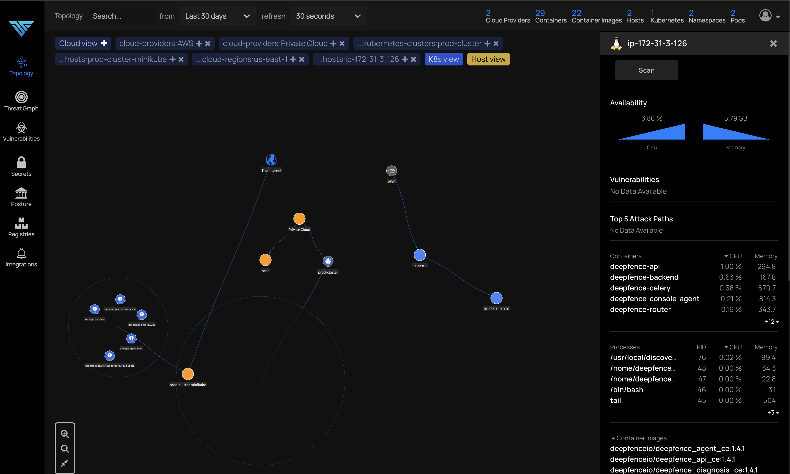

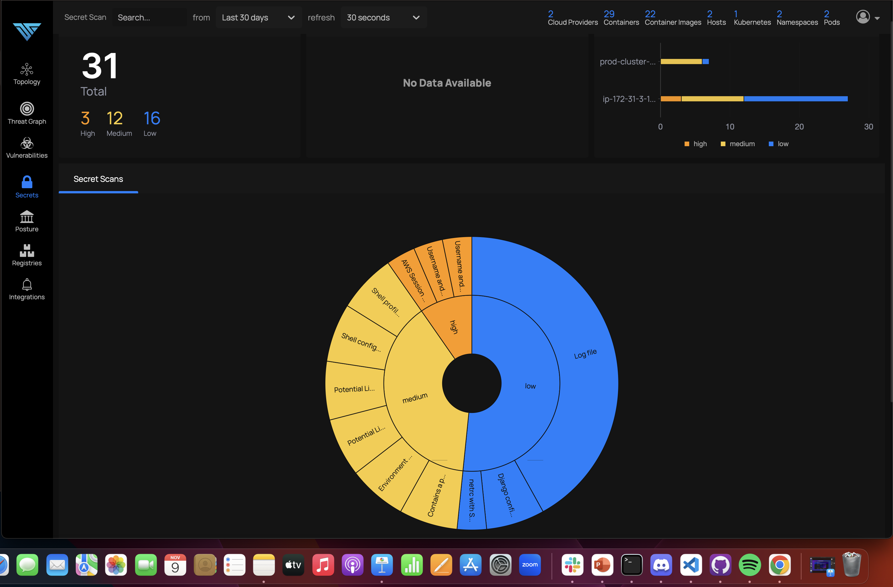